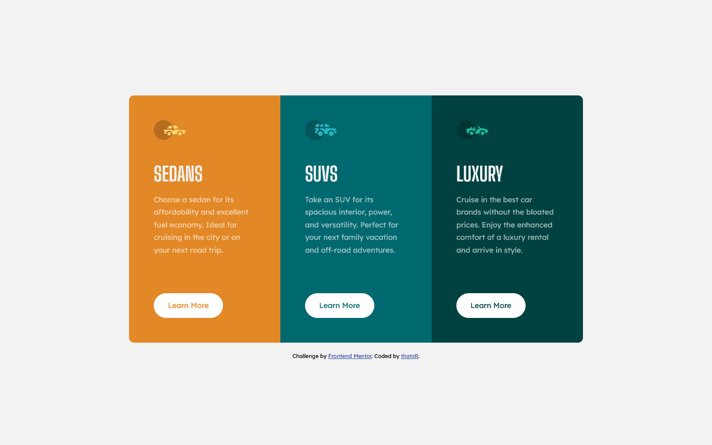
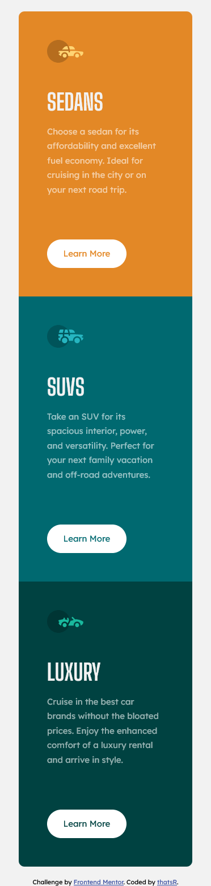

# Frontend Mentor - 3-column preview card component solution

This is a solution to the [3-column preview card component challenge on Frontend Mentor](https://www.frontendmentor.io/challenges/3column-preview-card-component-pH92eAR2-). Frontend Mentor challenges help you improve your coding skills by building realistic projects. 

## Overview

### The challenge

Users should be able to:

- View the optimal layout depending on their device's screen size
- See hover states for interactive elements

### Screenshot

| desktop | mobile |
| --- | --- |
|  |  |

### Links

- Solution URL: 
- Live Site URL: 

## My process

### Built with

- Semantic HTML5 markup
- CSS custom properties
- Flexbox
- Sass

### What I learned

I learned that if you're using sass with media query's you have to use the same format or else the css won't apply.

## Author

- Frontend Mentor - [@thatsR](https://www.frontendmentor.io/profile/thatsR)
